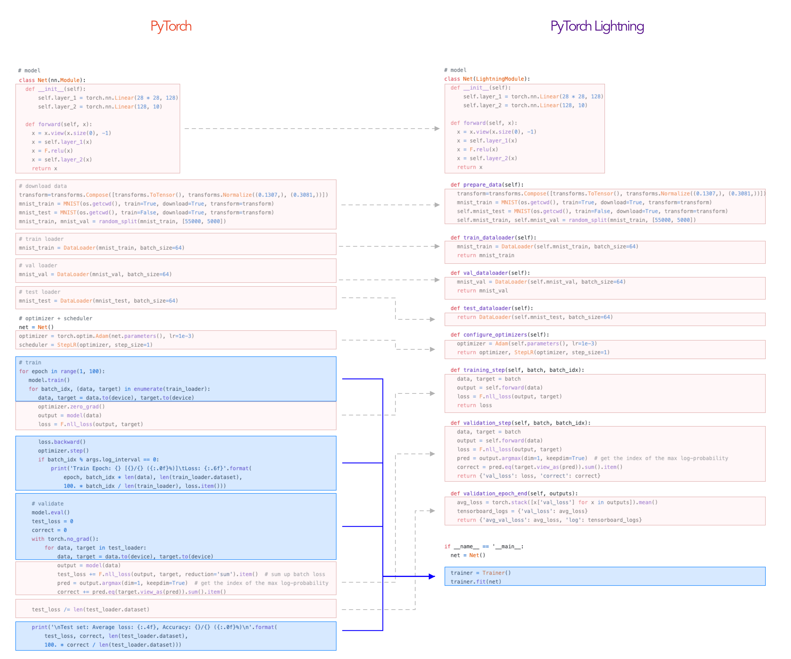

# PyTorch Lightning vs Ignite:

## Comparison 

>Note: The above table is taken from [here](https://neptune.ai/blog/pytorch-lightning-vs-ignite-differences#:~:text=Conclusion,components%20in%20a%20particular%20function.). This is just a personal shorter version that I wrote for learning purpose.

|         | Lightning | Ignite
|---------| ---------| --------|
Overall| Lightning is a high-level python framework built on top of Pytorch. It was created for researchers, specifically for trying new deep learning models which involved research scaling, multi-GPU training, 16-bit precision and TPU.|Ignite is another high-level library made on top of PyTorch. It helps with neural network training. Like Lightning, it was also created for researchers.
Why use| The Lightning API offers the same functionality as raw Pytorch, only much more structured. While defining the model, you don’t have to change any code, it’s exactly the same, all you need to do is inherit the **LightningModule** instead of **nn.module**.| Less code than pure PyTorch while ensuring maximum control and simplicity. 
Integration framework | TensorBoard, Neptune, MLflow, Wandb, Comet| TensorBoard, Neptune, MLflow, Wandb, Polyaxon|
Hardware support      | CPU, GPU, TPU                              |  CPU, GPU, TPU|
Distributed training|Yes (easy)|Yes (complicated)|
Production Example Notebooks|⭐⭐⭐⭐  [MNIST with Lightning](https://pytorch-lightning.readthedocs.io/en/latest/notebooks/lightning_examples/mnist-hello-world.html)|⭐⭐⭐⭐⭐  [MNIST with Ignite](https://github.com/pytorch/ignite/blob/master/examples/notebooks/FashionMNIST.ipynb)|

# Lightning

## Code comparison: Pytorch vs Lightning

# References
- [neptune.ai PyTorch Lightning vs Ignite](https://neptune.ai/blog/pytorch-lightning-vs-ignite-differences#:~:text=Conclusion,components%20in%20a%20particular%20function.)
- [https://pytorch-ignite.ai/](https://pytorch-ignite.ai/)
- [Toward data science Pytorch Lightning vs PyTorch Ignite vs Fast.ai](https://towardsdatascience.com/pytorch-lightning-vs-pytorch-ignite-vs-fast-ai-61dc7480ad8a)

